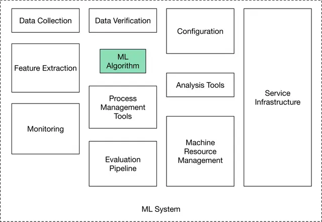
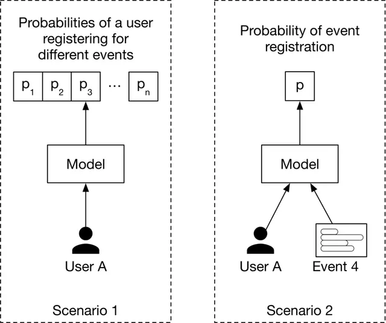
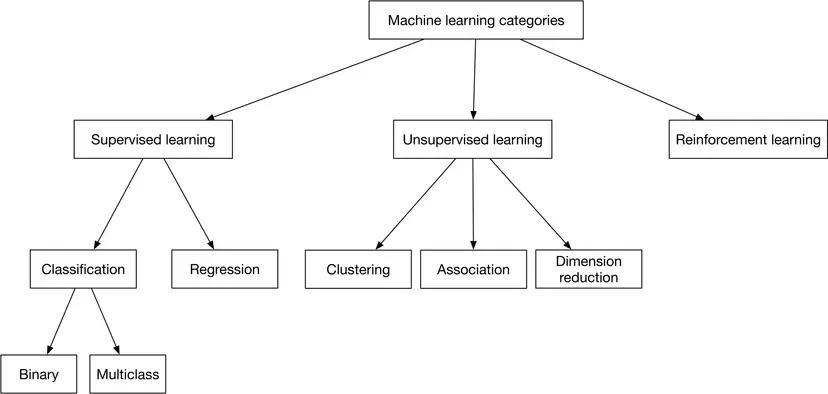
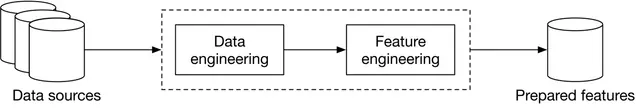
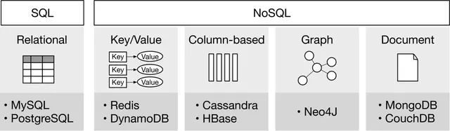
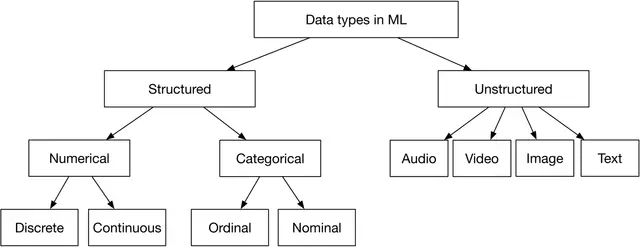

Reference: [ML System Design by ByteByteGo](https://bytebytego.com/courses/machine-learning-system-design-interview).

## Introduction and Overview

ML system design interviews expect us to answer open-ended questions. There is no single correct answer. We are evaluated on our thought process, our in-depth understanding of various ML topics, our ability to design an end-to-end system, and our design choices based on the trade-offs of various options.

Unstructured answers make the flow difficult to follow and derail open-ended discussions. It is important to follow a framework:

* Clarify the objective to help shape primary requirements. Transform the objective/ requirements into a tangible ML task.
* Data preparation is often overlooked. Don't be an idiot. Think through what will be fed to the model, both in terms of `X` and `Y`.
* Model development and evaluation must be an continuously iterative process. To `MeasureEverything` is important; ideally evaluation (and non-ML baselines) must be decided in the early stages of model development.
* Continuous monitoring after serving is essential to ensure that the objectives are being met and that the data/ concept does not drift.

### Clarify Requirements

Ask clarifying questions; asking questions exhibits attention to detail and intention. Attempt to understand the exact requirements and what the user (the interviewer) cares about:

* **Business objective**: Increase revenue? Increase `#`users? Increase engagement per user?

* **Features the system needs to support**: Move towards tangible features. Clarify if the features are essential or good-to-haves. Discuss feasibility while keeping a realistic ML system in mind. For example, a recommendation system might allow users to “like” or “dislike” recommendations, as those interactions could be used to label training data.

* **Data**: Data sources? How large is a datum and the dataset? Is it structured or unstructured? Do we have labels and is there a possibility for soft labels?

* **Constraints**: How much computing power is available (during inference; during learning we assume $\infty$ resources)? Is it a cloud-based system, or should the system work on a device? Is the model expected to improve automatically over time?

* **Scale of the system**: How many users do we have? How many items, such as videos, are we dealing with? What’s the rate of growth of these metrics?

* **Performance**: How fast must inference be? Is a real-time solution expected? Does accuracy have more priority or latency?

* **FairML**: Do Fairness, Accountability, Transparency, and Explainability matter?

### Frame the Problem as an ML Task

Effective problem framing is essential for translating a business objective into a clear ML task. This involves `(1)` ensuring that ML is necessary (though an ML system design interview probably requires an ML system$...$), `(2)` defining a precise ML objective that models can address (e.g., maximizing click-through rate instead of merely “increasing sales”), `(3)` specifying the system’s inputs and outputs as a blackbox — especially when multiple models are involved, and `(4)` choosing the appropriate ML paradigm (e.g., supervised learning for most cases, with further distinctions between binary/ multiclass classification or regression), ensuring the task aligns with the nature of available data and the intended outcome.

#### Define the ML Objective

Possible business objective: increase sales by `20%`. But, we cannot optimize over sales directly. For an ML system to solve a task, we must translate the business objective into a well-defined ML objective (say, to improve recommendations so users buy more items). We could also increase sales by increasing the `#`users by `20%`, but that might require moving away from improving recommendations towards, say, a better ad-serving system. Increasing sales can only be measured on the field and that is not a good ML objective for learning and evaluating the ML system.

A *good ML objective* is one that ML models can solve and be evaluated upon. 

#### Specify the System's I/O

As a black-box what are `X` and `Y`? In some cases, the system may be complex and we may need to specify the I/O of each component ML model. There may be more than one way to specify the I/O and these decisions matter for how we make downstream decisions.

{width=80%}

#### Choose the Right ML Paradigm

Generally, the solution will involve supervised learning. However, do not assume this. Also, its important to drill down into whether its classification (binary vs. multi-label/ nominal vs. ordinal) or regression. Suprisingly, weakly supervised learning is not discussed at all.

{width=100%}

### Data Preparation

Data with predictive power is essential for ML. Two essential processes: Data Engineering and Feature Engineering.

#### $\rightarrow$ Data Engineering
$\vspace*{1mm}$

Design and build pipelines for collecting/ storing/ retrieving/ processing data.

**Data Sources/ Data Storage** 

Data Sources: Understanding the data source provides context for label hygiene/ noise and general reliability. Metadata tags alongwith data are often a valuable source of information.  

Data Storage: Repository for peristently storing $+$ managing collections of data.

Extract, Transform, and Load (ETL) consists of three phases:

1. Extract: Extracts data from heterogenous data sources.
2. Transform: Data is cleansed, mapped, and transformed to meet operational needs.
3. Load: The transformed data is loaded into the target destination.

Data Types: Structured and unstructured data, with a number of different sub-types exist.

* Numerical: Discrete numbers.
* Categorical: Names/ labels.
  * Nominal: No numeric relationship.
  * Ordinal: Ordering exists.

{width=80%}

|      | Structured | Unstructured |
| :--- | :------    | :----        |
| Characteristics   | - Predefined schema$\newline$- Easy to search | - No schema$\newline$- Difficult to search |
|------------------------|------------------------------------------|------------------------------|
| Resides in        | - Relational databases$\newline$- Many NoSQL databases can store structured data$\newline$- Data warehouses | - NoSQL databases$\newline$- Data lakes |
|------------------------|------------------------------------------|------------------------------|
| Examples          | - Dates$\newline$- Phone numbers$\newline$- Credit card numbers$\newline$- Addresses$\newline$- Names | - Text files$\newline$- Audio files$\newline$- Images$\newline$- Videos |
Table: Summary of structured and unstructured data

#### $\rightarrow$ Feature Engineering
$\vspace*{1mm}$

Feature engineering process requires subject matter expertise and is highly dependent upon the task at hand. Two processes:

* Using domain knowledge to select and extract predictive features from raw data.
* Transforming predictive features into a format usable by the model.

Three important operations:
* Handle missing data: delete or impute.
* (Skewed) feature scaling. ML models (like SVMs) may struggle to learn when the features are in different ranges. Some models may struggle when a feature has a skewed distribution and the model expects each feature to be either linearly or normally distributed. Techniques: min-max-normalization, Z-score-standardization, log scaling, exponentiation, and discretization.
* Encode categorical variables: integer encoding, one-hot encoding (fair for a small number of possible values), and embedding learning (overcomes one-hot encoding and provides a continuous manifold for representing data).

Its important to generally look out for biases in the data. This should happen before Model Development begins.

